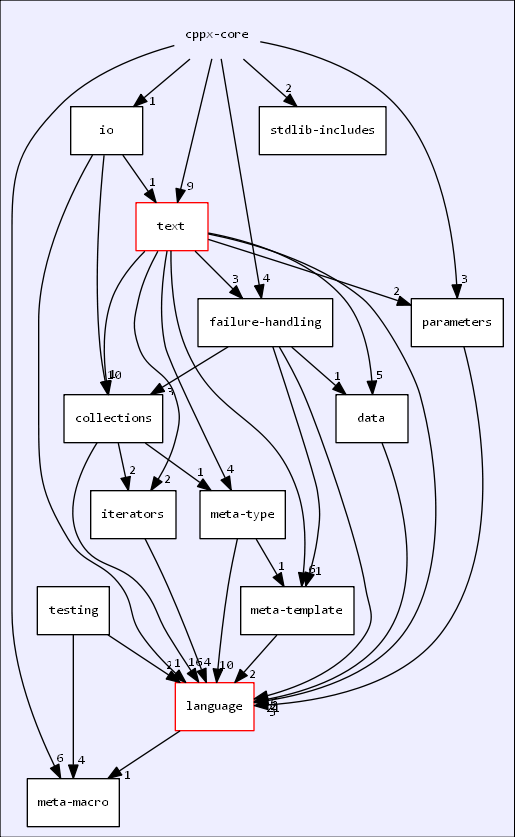

# *cppx-core* – C++ Core Functionality

The main purpose of [the *cppx-core* C++17 header library](https://github.com/alf-p-steinbach/cppx-core) is to provide basic Unicode functionality, e.g. UTF-8 ↔ UTF-16 conversion, plus other basic C++ coding functionality, to an as yet unpublished library called *C++ Band Aid*.

But *cppx-core* is eminently usable on its own.

*cppx-core* reduces the code needed to do some simple common things, for example including standard library headers, `using`-declaring a larger number of identifiers from a namespace, or throwing an exception with the throwing function's name in the message.

This code reduction will hopefully support Good Programming Practices&trade; in examples on the net, where brevity is often very important.

Dependency: the [*C header wrappers*](https://github.com/alf-p-steinbach/C-header-wrappers) nano-library that provides headers like *\<c/stdlib.hpp\>*.

---

A ~minimal example of *cppx-core* usage:

~~~cpp
// → examples/hello.cpp
#include <cppx-core/all.hpp>
$use_cppx( zero_to, spaces );
$use_std( cout, endl );

auto main() -> int
{
    for( const int i: zero_to( 7 ) )
    {
        cout << spaces( 36 - i*i ) << "cppx-core, yay!" << endl;
    }
}
~~~

~~~txt
                                    cppx-core, yay!
                                   cppx-core, yay!
                                cppx-core, yay!
                           cppx-core, yay!
                    cppx-core, yay!
           cppx-core, yay!
cppx-core, yay!
~~~

A larger (but still small) example is also available:
 
 * Basic *language* folder facilities, mostly *language/syntax*:  
  the [KWIC-like greeting example](example-kwic.md).

---

Parts of the library have generated [Doxygen documentation](https://alf-p-steinbach.github.io/cppx-core-DOxygen-generated-documentation/files.html).

The parts that I've not yet had time to document are present in the generated documentation, but just have no added explanations.

On Sunday 28ᵗʰ April 2019 *cppx-core* provided the following headers (the Doxygen documentation may be more up-to-date, and its file listing shows more details about what each header provides):

~~~ txt
•
│   all-ascii.hpp
│   all-calc.hpp
│   all-except-io.hpp
│   all.hpp
│   assert-c++17-or-later.hpp
│   config.hpp
│   _all_.hpp
│
├───collections
│       all.hpp
│       dynamic-size-checking.hpp
│       Enumerated_.hpp
│       is_empty.hpp
│       is_in.hpp
│       Map_.hpp
│       Matrix_.hpp
│       Sequence_util.hpp
│       Set_.hpp
│       Sorted_map_.hpp
│       Sorted_set_.hpp
│       Span_util.hpp
│       String_value_view_.hpp
│
├───failure-handling
│       Abstract_source_location.hpp
│       all.hpp
│       exception-propagation.hpp
│       exception-unwrapping.hpp
│       hopefully_or_fail.hpp
│       macro-dbginfo.hpp
│       macro-fail.hpp
│       macro-source_location.hpp
│       Source_location.hpp
│
├───io
│       all.hpp
│       debugging-output.hpp
│       monospaced_bullet_block.hpp
│
├───iterators
│       all.hpp
│       Count_iterator_.hpp
│       Forward_iterator_impl_.hpp
│
├───language
│   │   all.hpp
│   │
│   ├───bit-level
│   │       all.hpp
│   │       bits_per_.hpp
│   │       intlog2.hpp
│   │       sum_of_bits.hpp
│   │
│   ├───calc
│   │       all.hpp
│   │       floating-point-operations.hpp
│   │       integer-operations.hpp
│   │       named-numbers.hpp
│   │       number-type-properties.hpp
│   │       std-calc.hpp
│   │
│   ├───syntax
│   │       all.hpp
│   │       macro-define_tag.hpp
│   │       macro-items_of.hpp
│   │       macro-use.hpp
│   │       macro-with.hpp
│   │       type-builders.hpp
│   │
│   ├───tmp
│   │       all.hpp
│   │       basic-Enable_if_.hpp
│   │       basic-type-traits.hpp
│   │
│   └───types
│           all.hpp
│           byte-types.hpp
│           C_str_.hpp
│           fixed-size-checking.hpp
│           Int_.hpp
│           size-types.hpp
│           Truth.hpp
│           type-makers.hpp
│
├───meta-macro
│       all.hpp
│       macro-apply.hpp
│       macro-apply_with_fixed_arg.hpp
│       macro-invoke_macro.hpp
│       macro-joined.hpp
│       macro-n_arguments.hpp
│       macro-duplicate.hpp
│       lvalue_ref_to.hpp
│
├───meta-template
│       all.hpp
│       Enable_if_.hpp
│       Type_list_.hpp
│
├───meta-type
│       all.hpp
│       downcasted_to_.hpp
│       is_of_derived_class_.hpp
│       No_copy.hpp
│       No_copy_or_move.hpp
│       type-traits.hpp
│
├───misc
│       all.hpp
│       chrono-util.hpp
│       filesystem-util.hpp
│       random-numbers-util.hpp
│       repeat.hpp
│
├───parameters
│       all.hpp
│       In_out_ref_.hpp
│
├───stdlib-includes
│       all.hpp
│       basic-general.hpp
│       basic-io.hpp
│
├───testing
│       boost-test-framework-with-wide-string-fix.hpp
│       boost-test-framework.hpp
│       google-test-framework.hpp
│
└───text
    │   all.hpp
    │   basic-string-building.hpp
    │   pointers-from-string_view.hpp
    │   string-util.hpp
    │
    ├───ascii
    │       all.hpp
    │       ascii-util.hpp
    │
    ├───data
    │       all.hpp
    │       ascii-character-names.hpp
    │       Symbol_strings.hpp
    │
    └───unicode
            all.hpp
            assert-utf8-execution-character-set.hpp
            unicode-Code_point_generator.hpp
            utf16-from.hpp
            utf16-Generator.hpp
            utf16-n_units_for.hpp
            utf16-surrogate-pairs.hpp
            utf32-Generator.hpp
            utf8-from.hpp
            utf8-Generator.hpp
            utf8-is_the_execution_character_set.hpp
            utf8-iteration.hpp
            utf8-n_bytes_for.hpp
~~~

There's an ***all.hpp*** header in every folder. Including the top level <i>all.hpp</i> header includes everything except a testing framework. Alternatively you can include the top-level ***all-except-io.hpp*** header which includes the same as the top-level *all.hpp* except the *io* folder and the standard library's i/o headers.
